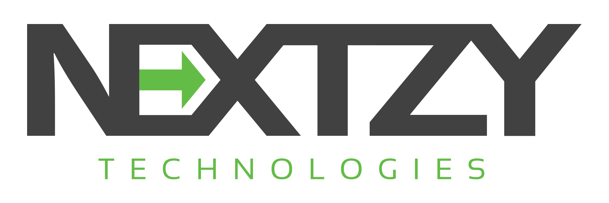

# NextDroid Android Architecture


Our core libraries that are customized to fit our Android projects' requirement. This include
* Network
* Dimension
* Database


### UPDATE
- version: 1.0.0


## Usage

clone our project and customize them
- change package name
- Implement at "Customize module"
- And anything that you want :)


## Project Structure

- `MVVM` with clean architecture : View ==> ViewModel ==> Repository ==> Model
- `Kotlin` with some compliment java classes
- Gradle 3.x
- Use no dagger ==> Easier to trace
- Database: We use `Realm` as a default. However, you can use anything you like. It is easily
- Test: `coming soon...`

```java
── NextDroid App: app module
 │
 ├─ Tab Common
 │    │
 │    ├─ CommonLibrary: library --> (Required) Core Class
 │    │
 │    ├─ Customize: library --> (Optional) Your customization for your specific needs happens here :)
 │    │
 │    ├─ Nextwork: library --> This is based on Retrofit 2.x
 │    │
 │    └─ Setting: library --> Setting library. E.g., SharePreference
 │
 └─ Example: library --> You can test your codes write here by building "debugImplementation" flavor
```

## Architecture


### View

coming soon...

### ViewModel

coming soon...

### Repository

coming soon...

### Model

coming soon...

### Database

coming soon...

### Network

coming soon...


## Special Thank
 - API: Live 500 px by [Nuuneoi](https://github.com/nuuneoi)
 - [GithubBrowserSample](https://github.com/googlesamples/android-architecture-components/tree/master/GithubBrowserSample) by Google Example


# Licence

Copyright 2017 Nextzy Technologies Co.,ltd

Licensed under the Apache License, Version 2.0 (the "License"); you may not use this work except in compliance with the License. You may obtain a copy of the License in the LICENSE file, or at:

http://www.apache.org/licenses/LICENSE-2.0

Unless required by applicable law or agreed to in writing, software distributed under the License is distributed on an "AS IS" BASIS, WITHOUT WARRANTIES OR CONDITIONS OF ANY KIND, either express or implied. See the License for the specific language governing permissions and limitations under the License.


### Developed By Thai android developer.




Follow [facebook.com/nextzy](https://www.facebook.com/nextzy) on Facebook page.
or [Nextzy blog](https://blog.nextzy.me/) at our Medium blog. :)

For contact, shoot me an email at geek@nextzy.com